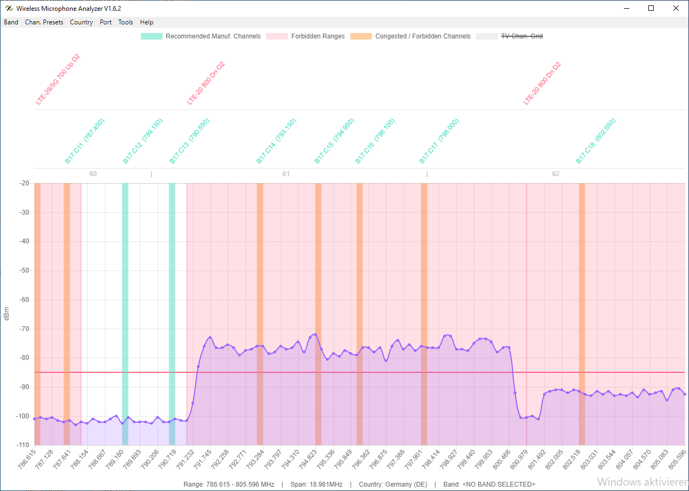

# Wireless Microphone Analyzer
The Wireless Microphone Analyzer shows the frequency spectrum captured with the "RF Explorer" or "tinySA" hardware. Wireless microphone vendors (e.g. Sennheiser, Shure etc.) have defined specific frequency ranges for their equipment which they gave proprietary names. This tool allows you to preselect these bands. E.g. if you bought a "Sennheiser EW 100 G3" in Sennheiser's E-Band, you can select this range in the app, to check whether and were there are any interferences. You can also also overlay the vendor recommended channel frequency presets, which are optimized by vendors and guarantee a intermodulation free operation of multiple microphones in parallel. The app also shows forbidden frequency ranges in red. E.g. LTE up-/downstream ranges which meanwhile overlap with old microphone frequency bands.

### Connection
When starting the app, it automatically tries to detect the serial port to which the scanner hardware is attached to. Nevertheless you have to make sure that the correct hardware type is selected! If this doesn't work, you can open the "**Port**" menu and select the corresponding port manually. In case there is still no display, please restart the app or press **\<CTRL>\<R>**. It looks like sometimes the serial ports are not detected properly by the underying Electron framework.

### UI Description
It is possible to show/hide each of the displayed graphs:

* Recommended manufacturer channels
* Forbidden ranges
* Congested / forbidden channels
* TV channels

by clicking the corresponding entry in the legend on top.

The following mouse/keyboard commands zoom/move the frequency range:

* **Mouse wheel scroll OR Arrow up/down** zooms in/out of the waveform. Which means decreasing/increasing the span width of the spectrum analyzer

* **Mouse wheel tilt OR Arrow left/right** moves the frequency range down-/upwards (when holding down <SHIFT> freqency range shifts by 50%)

* **\<CTRL> Arrow left/right** toggles between vendor channel presets within the selected vendor specific frequency band.

### Installation

#### Windows
Download and install the **.exe** installer. The required drivers for Windows can be found here: https://j3.rf-explorer.com/43-rfe/how-to

#### Mac
Download and install the **.dmg** package. Also make sure to download and install the necessary USB-Serial driver according to this guide: https://j3.rf-explorer.com/43-rfe/how-to/205-h2-macosx-drivers

**IMPORTANT:** For Catalina (MacOS 10.15) and later, make sure to download the latest USB-Serial driver! Older versions cannot be installed anymore due to Apple's security restrictions!

#### Linux
For all common Linux distribuitions the **.AppImage** can be used without any installation (like a portable applications on Windows).

For Linux distributions using Debian packages, a Debian package is available as well. Just download the **.deb** package and install it as follows:
    
    sudo dpkg -i <package_name>.deb

If the command above fails, you might need to update the dependencies with:

    sudo apt install -f

In order to run the tool as non-root, you have to add your username to the "dialout" group:

    sudo gpasswd --add <your_username> dialout

**IMPORTANT:** After adding your username to the group you should reboot your system.

When you are getting this error message when trying to run the AppImage:

    dlopen(): error loading libfuse.so.2

execute this command to install libfuse.so.2:

    sudo apt install libfuse2

When you are getting an error message like this when trying to run the AppImage:

    [4613:1220/145834.062235:FATAL:setuid_sandbox_host.cc(158)] The SUID sandbox helper binary was found, but is not configured correctly. Rather than run without sandboxing I'm aborting now. You need to make sure that /tmp/.mount_Wireleu5FpRs/chrome-sandbox is owned by root and has mode 4755.

try running with the option: **--no-sandbox**

For Linux normally no special driver is required, as the corresponding driver is already included in most Linux distribuitions. In case you are on a different OS and the driver is missing in your installation, you can download it from [here](https://www.silabs.com/developers/usb-to-uart-bridge-vcp-drivers?tab=downloads).
